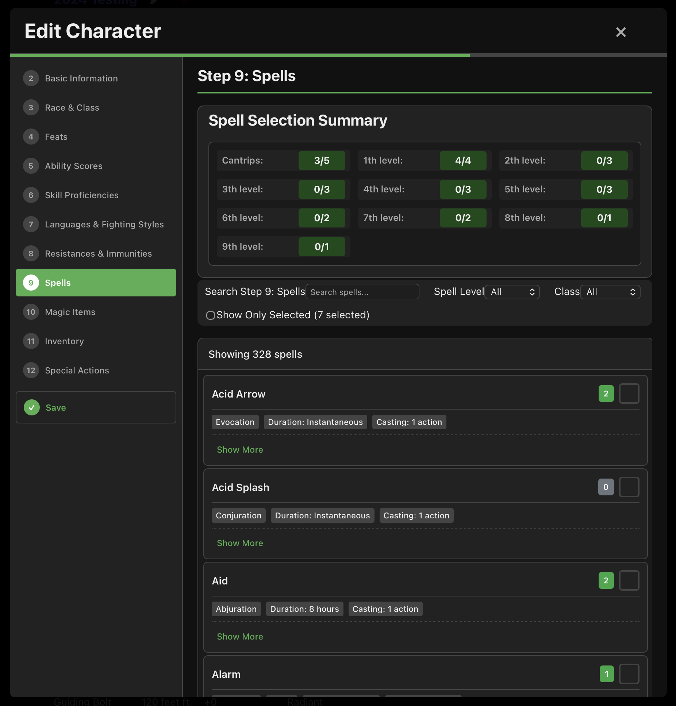
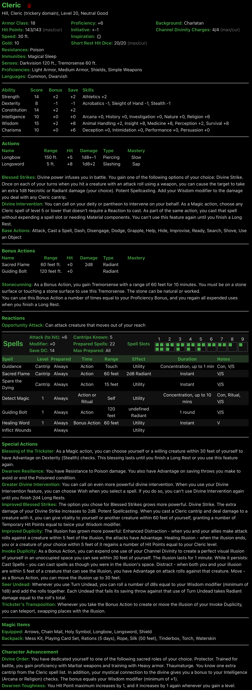
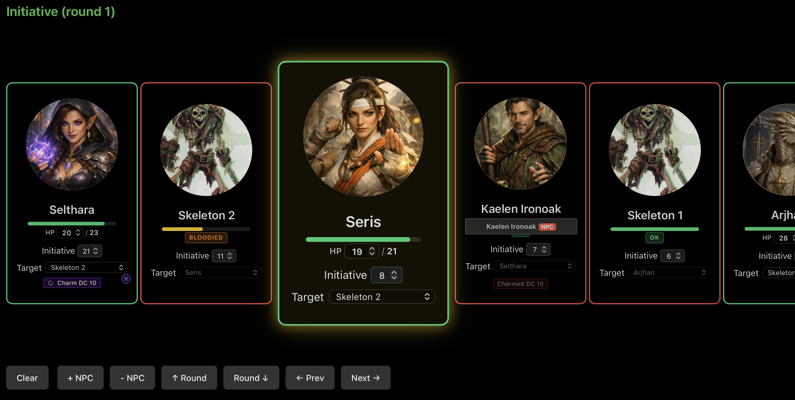
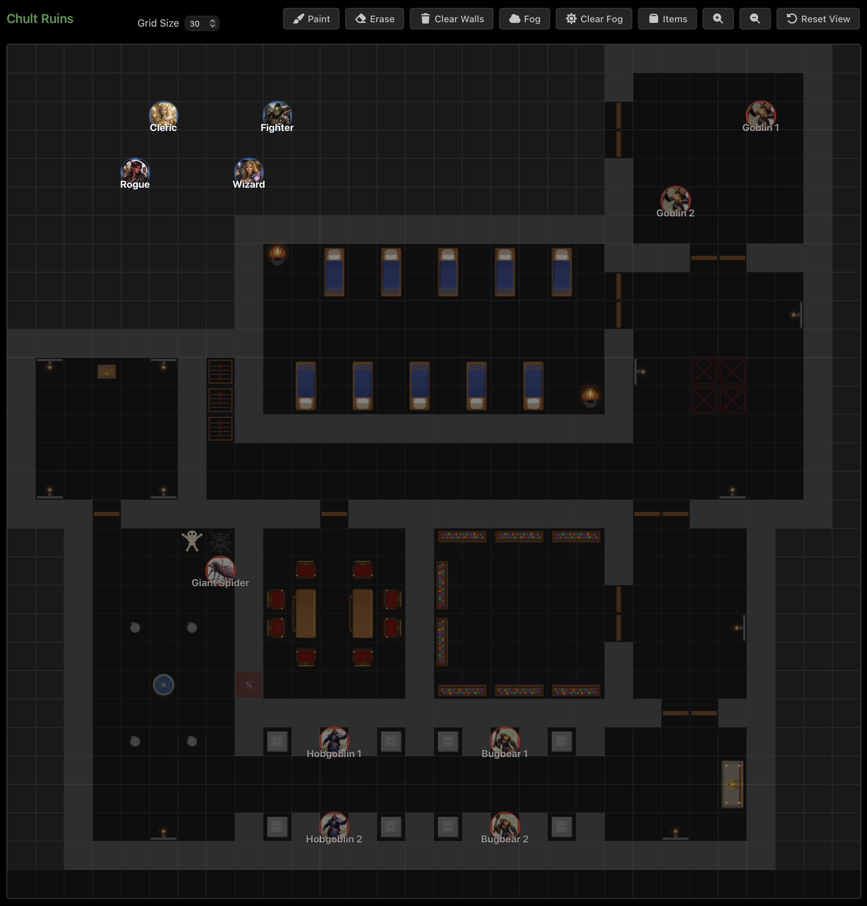
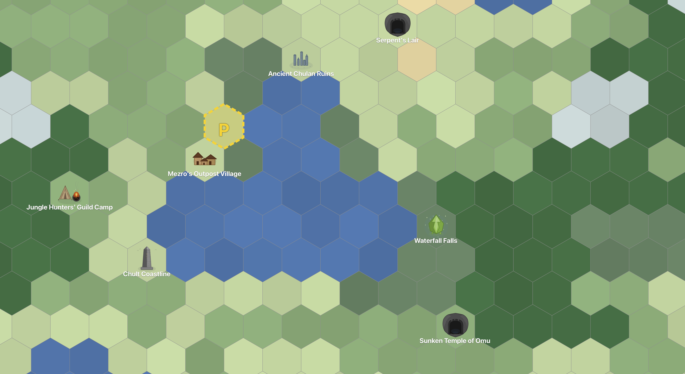

# 🐉 D&D Character Sheet

> <strong>WARNING:</strong> This application is going through a major enhancement of automating ALL class, subclass, race, subrace, background, and feat special abilities and should be considered Alpha software until that implementation is complete, and this warning is removed.

---

**A complete, self-hosted D&D toolkit — character sheets, real-time party sync, and a full GM campaign suite. No accounts, no database, no subscriptions. Just your browser and your imagination.**

<p>
  <strong>✨ Real-time party sharing</strong> &nbsp;·&nbsp;
  <strong>📖 Dual ruleset support (5e &amp; 2024)</strong> &nbsp;·&nbsp;
  <strong>🗺️ Indoor &amp; outdoor maps with fog of war</strong> &nbsp;·&nbsp;
  <strong>🎲 Encounter, dungeon &amp; loot generators</strong> &nbsp;·&nbsp;
  <strong>📜 Quest, faction, NPC &amp; settlement management</strong> &nbsp;·&nbsp;
  <strong>🖨️ Print-ready character sheets</strong> &nbsp;·&nbsp;
  <strong>📋 Full campaign activity log</strong> &nbsp;·&nbsp;
  <strong>⚔️ Condition, exhaustion &amp; cover tracking</strong> &nbsp;·&nbsp;
  <strong>🌦️ Overland travel with weather</strong> &nbsp;·&nbsp;
  <strong>🧙 Metamagic, auras &amp; automation</strong> &nbsp;·&nbsp;
  <strong>🎯 Multi-target spell targeting</strong> &nbsp;·&nbsp;
  <strong>🔄 Comprehensive rest system</strong>
</p>

---

## 🌟 What Is This?

A **complete D&D character sheet and campaign management suite** that runs on your local network. One player (the DM) starts the app, shares a link, and everyone — on their own phone, tablet, or laptop — sees the same characters, maps, and combat tracker in real time.

**As a digital sheet:** Everything is organized, calculated automatically, and **shared instantly with your entire party**. No more lost notes, no more math errors, no more "wait, what's your AC?" mid-combat.

**As a printable sheet:** The app creates **beautiful, well-organized character sheets that fit on a single page**. All the critical stats you need during combat are front and center. Print it out, keep it at the table, and have everything you need at a glance — no flipping through rulebooks.

**As a GM toolkit:** Indoor maps with fog of war and spell overlays, outdoor hex maps with procedural terrain and overland travel, encounter and loot builders, a procedural dungeon generator, quest tracking, faction management, NPC management with full stat blocks, campaign notes, and a full activity log — everything you need to run a campaign from one app.

> **No computer expertise required.** If you can open a web browser, you can use this app. The setup instructions at the bottom are written for complete beginners.

---

## 🔄 How It Works — Real-Time Party Sharing

Here's what makes this app special: **everyone sees the same thing, instantly**.

**At the table:**
1. The **Dungeon Master** starts the app on their computer
2. The DM shares a **link** with players (via text, email, or group chat)
3. Players open the link on their own devices (phone, tablet, laptop)
4. **Everyone views the same character sheets and campaign tools**
5. When anyone makes a change — spending hit points, using a spell slot, rolling initiative — **everyone sees it right away**

Changes sync via **Server-Sent Events (SSE)**, so there's no refresh lag and no polling. The moment one person acts, every connected screen updates.

No more "Wait, how many hit points do you have?" mid-combat! No more passing around a single phone! No more lost notes!

---

## 🎯 Feature Overview

| Feature | Description |
|---------|-------------|
| 📜 **Campaign Management** | Multiple campaigns, switch/rename/delete, auto-saved to JSON |
| 👤 **12-Step Character Wizard** | Ruleset, race, class, abilities, skills, spells, feats, inventory, magic items, backgrounds, and more |
| 📊 **Digital Character Sheet** | Live-updating, click-to-roll, condition & exhaustion tracking, resource management |
| 🖨️ **Print-Ready Sheets** | Single-page, clean layout, critical stats front and center |
| ⚔️ **Initiative Tracker** | Turn order, round counter, NPC management, keyboard shortcuts, battle notes |
| 👾 **Encounter Builder** | Monster selection, XP budgets, difficulty ratings, save/load, auto-generation by environment, loot tables |
| 🗺️ **Indoor Maps** | Grid-based, fog of war, 25+ furniture types, spell overlays, ruler tool, door toggling, bulk selection |
| 🏔️ **Outdoor Hex Maps** | Procedural terrain, rivers, roads, POIs, weather, overland travel with paces, indoor map linking |
| 🏚️ **Dungeon Generator** | BSP algorithm, configurable rooms, corridors, doors, triggered from outdoor encounters |
| 🗺️ **Terrain Generator** | Procedural hex terrain using fractal noise with configurable seed, grid size, and biome weights |
| 🏘️ **Settlement Generator** | Procedural settlements with culture-based naming, services, named NPCs, rumors, government, and threats |
| 📝 **Campaign Notes** | Markdown-supported story notes with location tracking, private notes, timestamps, party level |
| 🧙 **NPC Management** | Full stat blocks (abilities, saves, skills, AC, HP, actions, traits, reactions), attitudes, tags, avatars, one-click to initiative |
| ⚡ **NPC Generator** | Instant procedural NPC generation — race-based names, traits, stat blocks, and personality at the click of a button |
| 📜 **Quest Tracking** | Active/completed/failed statuses, color-coded badges, markdown descriptions, rewards, notes, search |
| 🤝 **Faction Management** | Influence scale (1-10) with 4 color-coded tiers, goals, markdown notes, search |
| 📋 **Campaign Activity Log** | Dice rolls with full details, manual notes, travel events, loot awards, condition tracking — all with timestamps |
| 🎲 **Built-In Dice Roller** | Advantage, disadvantage, custom expressions, animated rolls, auto-crit/fumble detection, resistance notices |
| 🎲 **Dice Tray** | Inline d4, d6, d8, d10, d12, d20, d100 dice buttons in the sidebar for quick reference rolls |
| 🎯 **Advanced Dice Results** | Indomitable Will reroll, Fanatical Focus, Stroke of Luck, Lucky feat, Potent Cantrip, Glorious Defense, Shield spell immunity, graze damage, Unbreakable Majesty, Veer (Mounted Combatant) |
| 🎯 **Multi-Target Spell Targeting** | Select multiple targets for Magic Missile, Aid, Heroes' Feast, Greater/Lesser Restoration, Remove Curse, Mage Armor, Shield of Faith, Protection from Energy, and Resistance |
| 📥 **Character Import/Export** | Download/upload JSON files for between-session work |
| 🎨 **Dark/Light Theme** | Toggle for late-night sessions |
| 📖 **Dual Ruleset Support** | 5e and 2024 Essentials, even mixed within one campaign |
| 🌦️ **Weather System** | Biome-based weather with animated overlays (rain, snow, fog, wind, lightning), travel modifiers |
| 🗡️ **Loot Generator** | CR-tiered treasure tables — currency, gems, jewelry, equipment, and magic items by rarity |
| 🗺️ **Map Manager** | Create, rename, activate, delete maps, indoor/outdoor type selection, markdown descriptions, dungeon/terrain generation |
| 🛡️ **Cover System** | 4-level cover (none, half, three-quarter, full) computed from walls, doors, and furniture using line-of-sight ray casting |
| ✨ **Metamagic Engine** | 8 metamagic options with SP costs, Arcane Apotheosis, Font of Magic slot conversion, pre/post-cast filtering |
| 💫 **Aura Systems** | Paladin Aura of Protection, plus Auras of Alacrity, Courage, Devotion, and Warding — range-aware with map positions |
| 🤖 **Automation Engine** | Automated save prompts, auto-damage with saves, concentration checks, condition effects, critical hit dice doubling, and more — with 100+ class-specific feature modals (weapon masteries, divine interventions, elemental affinities, teleports, wild companions, and more) |
| 🎯 **Range Validation** | Melee/ranged checks with disadvantage, long-range penalties, and feat-based range effects (e.g., Crossbow Expert) |
| 🔄 **Rest System** | Short rest with Hit Dice, Song of Rest, Arcane Recovery, Font of Inspiration, Sorcerous Restoration, Bolstering Treats, Memorize Spell; Long rest with full restore and exhaustion reduction |
| 🎭 **Character Advancement** | Feats with prerequisite validation, multiclass features, feature choice selectors (Spell Mastery, Signature Spells) |
| 🎭 **Reaction Features** | Haste extra actions, Nick weapon mastery, Horde Breaker, Revivification, Stand (Power Word Heal), and more — auto-surface based on active buffs |
| 🤝 **Aura Combo Effects** | Multiple character auras combine — speed bonuses, resistances, immunities, and protection stack when overlapping |
| 📋 **Prompt Queuing** | Multiple save prompts and concentration prompts are queued so you never lose a roll |

---

## 📜 Campaign Management

A **campaign** is one adventure story with its own party of heroes. This app lets you:

- **Run multiple campaigns at once** — Keep your epic fantasy saga separate from your one-shot dungeon crawl
- **Switch between campaigns** with one click
- **Rename or delete campaigns** when the story ends
- **Never lose your characters** — Everything is saved automatically to JSON files

---

## 👤 Character Creation (12-Step Wizard)

Creating a character doesn't have to be overwhelming. The app guides you step by step:

- **Step-by-step wizard** — No more flipping through rulebooks trying to remember what to do next
- **Ruleset selection** — Pick between the classic **5th Edition** rules or the new **2024 Essentials** rules
- **Race and class selection** — Cascading dropdowns for race, subrace, class, and subclass
- **Ability scores** — Point-buy system with built-in tracking (30 points, 8–15 base)
- **Skills and expertise** — Choose proficiencies and expertise (for Bards and Rogues)
- **Languages** — Common, elvish, dwarvish, and more
- **Fighting styles** — Choose your fighting style (Fighters, Paladins, Rangers, or as a feat)
- **Feats** — Select feats with prerequisite validation
- **Resistances and immunities** — Track damage resistances and immunities
- **Spell selection** — Choose spells with limits validation; spells granted by subclasses, races, subraces, and feats are auto-assigned
- **Prepared vs. known spells** — The wizard correctly distinguishes between prepared and known spellcasting, surfacing the right preparation workflow per class and ruleset
- **Magic items** — Browse, search, and add items with attunement tracking
- **Inventory** — Gold, backpack, and equipped items
- **Custom special actions** — Add homebrew features or abilities not in the standard rules
- **Backgrounds** — Choose your character's background; granted buffs are auto-integrated into your sheet
- **Auto-assigned spells** — Spells granted by subclasses, races, subraces, and feats are automatically added to your character
- **Auto-integrated buffs** — Passive bonuses from races, backgrounds, and feats are automatically applied to your stats
- **Rules validation** — The app checks your character against the rules and warns you if something doesn't match



---

## 📊 Character Sheet — Digital & Printable

Your character sheet works two ways:

**On Screen (Digital Mode):**
Your sheet becomes a **living document** that updates as you play. Click any stat to roll dice, see detailed breakdowns, track resources, manage conditions, and share everything in real time with your party.

**On Paper (Printed Mode):**
The app creates **beautiful, well-organized character sheets that fit on a single page**. When you print:
- **All critical combat stats are on the first page** — AC, HP, speed, initiative, attacks, saving throws, and skills are front and center
- **Clean, easy-to-read layout** — No clutter, no wasted space. Find what you need in seconds during combat
- **Management sections hide automatically** — Campaign buttons, audit warnings, and other digital-only features disappear when printing
- **Fits on one page** — The layout is optimized so most characters fit on a single sheet of paper

### Identity & Summary

- **Avatar image** with click-to-expand modal
- **Race/subrace** with creature type annotation
- **Class/subclass** with domain/type annotation
- **Alignment**, **proficiencies**, and **languages**
- **Senses** — Darkvision, blindsight, tremorsense, etc.
- **Resistances, vulnerabilities, and immunities** — At a glance
- **Auto-integrated buffs** — Passive bonuses from races, backgrounds, and feats are automatically applied to stats (ability scores, saves, AC, HP, skills, etc.)

### Core Stats (All Calculated Automatically)

- Ability scores and modifiers (click to see full description, click bonus to roll ability check)
- Armor Class (click to see the formula breakdown!)
- Hit Points and Hit Dice
- Speed (including race and class bonuses)
- Saving throws and skill proficiencies (click to roll)
- Initiative bonus
- Proficiency bonus
- Inspiration tracker (toggle on/off)

### XP & Leveling

- **XP modal** — Click the level/XP display to add or subtract XP
- **Milestone leveling mode** — Toggle between XP tracking and milestone leveling
- **Live preview** of projected XP changes
- Persisted per character/campaign

### Condition Tracking

- **15 tracked conditions** — Blinded, Charmed, Cursed, Deafened, Frightened, Grappled, Incapacitated, Paralyzed, Petrified, Poisoned, Prone, Restrained, Stunned, Unconscious
- **Automatic stat penalties** — Conditions automatically propagate into attack advantage/disadvantage, auto-fail saving throws, speed zero, "cannot act" state (disabling all actions), auto-crit flags (paralyzed/unconscious), concentration broken, and more
- **Condition removal saves** — Many conditions require a d20 roll vs DC 10 on the mapped ability (e.g., Charmed=WIS, Frightened=WIS, Grappled=STR) to shake off — with automatic rolling and logging
- **Target-aware effects** — Conditions also affect how attackers interact with the character (advantage/disadvantage vs prone, auto-crit within 5 ft for unconscious, etc.)

### Exhaustion System

- **6 exhaustion levels** (level 6 = DEAD)
- **Constitution save to reduce** — d20 vs DC (10 + current level), with roll logging
- **Global penalty propagation** — -2 per level applied to ability checks, saves, attacks, spell attacks, initiative, speed (-5 ft/level), and modifier values
- **Visual penalty indicators** on all affected stats

### Death Saving Throws

- **3 success + 3 failure toggles** — Automatically appear when current HP reaches 0 or below
- **Automatic notification** — Dropping to 0 HP automatically triggers a death saving throw notification with die roller popup
- **Persistent storage** — Saves and failures stored per character/campaign
- **Auto-clear on healing** — Death saves reset when HP is restored above 0

### Class-Specific Resources (Tracked During Play)

- **Barbarian**: Rage points (max/current), extra attacks, rage damage bonus, weapon mastery
- **Bard**: Bardic Inspiration die size and uses, Song of Rest die, Font of Inspiration (regain on short rest), Magical Secrets count, expertise skills
- **Cleric**: Channel Divinity charges, Destroy Undead CR, Divine Spark, Divine Intervention spell selection
- **Druid**: Wild Shape uses, Wild Shape Max CR, Beast Forms Known, Wild Shape Limitations, Wild Companion, Evergreen Wild Shape, Aspect of the Wilds
- **Fighter**: Fighting styles, extra attacks, weapon mastery, Second Wind, Action Surge, Psi Warrior energy pool, Battle Master superiority dice, War Magic cantrip/spell
- **Monk**: Martial Arts die, Focus Points, Focus Save DC, Unarmored Movement increase, Open Hand Technique, Supreme Sneak, Cunning Strike, Favored Foe, Perfect Focus, Third Eye, Soulstitch Spells, Illusory Reality
- **Paladin**: Fighting styles, extra attacks, Channel Divinity, Aura Range, Sacred Weapon damage type, Lay on Hands pool, Eldritch Knight arcane recovery
- **Ranger**: Fighting styles, extra attacks, Favored Enemies, Ranger spell list, Primeval Awareness
- **Rogue**: Sneak Attack damage, expertise skills, Uncanny Dodge, Evasion, Assassin abilities, Thief abilities, Soulknife psychic blades
- **Sorcerer**: Sorcery Points, Metamagic Known, spell slot creation costs, Font of Magic conversion, Sorcerous Restoration (2024), Innate Sorcery buff, Arcane Apotheosis (level 20)
- **Warlock**: Arcanums Known (per level 6/7/8/9), Eldritch Invocations Known, Pact Boon, Mystic Arcanum
- **Wizard**: Arcane Recovery Levels, spell preparation, Spell Mastery, Signature Spells, Divination Savant, Illusion Savant, Portent Dice, Wizard Memorize Spell (swap from spellbook on short rest)

### Character Advancement

- **Feats** — Select feats with prerequisite validation; feats grant passive buffs auto-integrated into stats
- **Multiclass features** — Track multiclass abilities and feature choices
- **Feature choice selectors** — Spell Mastery, Signature Spells, and other selectable features

### Spell Management

- **Visual spell slot tracking** — Click a spell slot to use it, click again to reset after a long rest
- **Prepare spells** — Toggle which spells are prepared for the day (5e rules; 2024 spells are always known)
- **Filter and sort** — Show only prepared spells, sort by level or name
- **Spell details** — Click any spell to see its full description, higher-level effects, casting time, range, and duration
- **Spell attack bonus and save DC** — Automatically calculated and displayed
- **Spell damage rolls** — Clickable damage effects with dice parsing (e.g., "1d8+3 fire")
- **Spell attack rolls** — Clickable to-hit with d20 and spell attack bonus
- **Saving throw resolution** — The UI understands saving throw-based spells, showing success/failure results and whether the target takes full damage, half damage, or no damage on a save
- **Auto-transition to damage** — After a successful hit roll, the damage roll automatically begins — no extra clicks
- **Concentration saves** — Taking damage while concentrating automatically triggers a Constitution saving throw notification with die roller popup; failed saves break concentration
- **Spell upcasting** — Choose which spell slot level to upcast a spell to
- **Free cast detection** — Spell Mastery, Signature Spells, Divination Savant, and Natural Recovery are detected and allow casting without slot deduction
- **Multi-target spells** — Select multiple targets for spells like Magic Missile, Aid, Heroes' Feast, Greater/Lesser Restoration, Remove Curse, Mage Armor, Shield of Faith, Protection from Energy, and Resistance
- **Metamagic selection** — Choose metamagic options when casting Sorcerer spells

### Combat Readiness

- **Actions** — Attacks with hit bonuses, damage, and damage types (click to roll vs target's AC with HIT/MISS determination; successful hits auto-advance to damage roll)
- **Bonus actions** — Clearly separated from regular actions, including Horde Breaker conditional display
- **Reactions** — Opportunity attacks (with Inspiring Movement / Tactical Shift / Agile Movement awareness), reaction spells, Revivification, and Stand (Power Word Heal)
- **Special actions** — Class features, fighting styles, auto-integrated from rules data (Great Weapon Fighting, Protection), and custom abilities with markdown descriptions
- **Haste Extra Action** — When Haste buff is active, gain an extra attack, dash, disengage, hide, or use an object
- **Nick weapon mastery** — Tracking for finesse weapon bonus damage
- **Auto-damage with saving throws** — Dealing damage to a target automatically prompts a saving throw when applicable, with a die roller popup showing full results
- **Prompt queuing** — Multiple save prompts and concentration prompts are queued so you never lose a roll

### Short Rest & Long Rest

- **Short Rest modal** — Interactive hit die rolling (d{hitDie} + CON bonus, minimum 1 HP per die)
  - "Roll One" and "Roll All" buttons with full roll log table showing each individual result
  - Auto-recovers short-rest class resources (Channel Divinity, Wild Shape, Second Wind, Focus Points)
  - **Song of Rest** bonus for Bards
  - **Sorcerous Restoration** — Regain sorcery points on short rest (2024 feature)
  - **Font of Inspiration** — Regain Bardic Inspiration uses on short rest
  - **Bolstering Treats** — Temporary HP from short rest
  - **Arcane Recovery** — Regain expended wizard spell slots on short rest
  - **Wizard Memorize Spell** — Swap prepared spells from spellbook on short rest
- **Long Rest** — One-click full restoration of HP, spell slots (levels 1-9), hit dice, all class resources
- **Exhaustion reduction** — Long rest decreases exhaustion by 1 level
- **Trance support** — Races with Trance (like elves) show "4 hours" label on long rest

### Inventory & Wealth

- **Gold pieces** — Editable and persisted
- **Equipped items** and **Backpack items** sections
- **Equipment lookups** — Click any item to search the full database and see description, cost, weight, category
- **Magic items** — Type, rarity, attunement status, full HTML descriptions

### Character Portability

- **Download your character** as a JSON file for backup or between-session editing
- **Upload characters** to any instance of the app — share with your DM or move between campaigns



---

## ⚔️ Combat Tracking System

When battle erupts, the app becomes your **tactical command center**:

### Initiative & Turn Order

- All party members and enemies listed in initiative order
- Add or remove NPCs as needed (including one-click from the NPC editor)
- Edit creature names and add battle notes
- Clear visual indicator of whose turn it is

### Round Tracking

- Visual combat round counter
- Advance or go back rounds easily

### Keyboard Shortcuts (for fast combat)

- **↑ ↓** — Move to the next/previous creature
- **← →** — Go back/forward one round
- **+ -** — Add/remove NPCs

### Battle Notes

- Add notes to any creature (track conditions, remember tactics, etc.)



---

## 🎲 Dice Roller

The built-in dice roller is deeply integrated throughout the app:

- **Click-to-roll everywhere** — Any stat on the character sheet, any attack, any save, any skill
- **Advantage/Disadvantage toggles** — Two dice pre-rolled; toggle after the fact or forced by conditions
- **Auto-critical/fumble detection** — Natural 20 triggers "Critical Hit!" with automatic double damage dice, natural 1 triggers "Fumble"
- **Hit/Miss determination** — Attack rolls auto-compare against target's AC, then auto-transition to damage roll on a hit
- **Save success/failure** — Saving throws auto-compare against DC
- **Damage resistance notices** — Cross-references target resistances with damage type
- **Auto-damage application** — Damage rolls automatically apply with saving throw prompts and die roller popups
- **Campaign log integration** — Every roll is logged with timestamp, character name, full breakdown
- **Custom expressions** — Supports dice notation like "2d6+3"

### Advanced Dice Features

- **Indomitable Will reroll** — Reroll a failed save (Fighter feat)
- **Fanatical Focus** — Reroll a missed attack (Paladin feat)
- **Disciplined Survivor** — Reroll a failed death save (Fighter feat)
- **Stroke of Luck** — Force a natural 20 on a roll (Warlock feat)
- **Lucky feat** — Grant advantage or disadvantage for 1 LP
- **Potent Cantrip** — Take half damage on a successful save for cantrips
- **Glorious Defense** — Counter-attack when hit by a melee attack (Paladin feature)
- **Shield spell immunity** — Automatically blocks the Shield spell's AC bonus
- **Graze damage** — Partial damage on a failed save for certain attacks
- **Unbreakable Majesty** — Modify attack/save DCs (Paladin feature)
- **Veer (Mounted Combatant)** — Avoid damage from your mount being hit
- **Quick-roll player saves** — Players can quickly roll saves against DM prompts

### Dice Tray

The sidebar includes a **Dice Tray** with clickable d4, d6, d8, d10, d12, d20, and d100 buttons for quick reference rolls — no need to navigate to a character sheet first.

---

## 🏰 Campaign Tools (GM Features)

The app includes a comprehensive suite of tools for Dungeon Masters. GM features (encounter builder, map editing, quest/faction/NPC management) are automatically enabled when the app runs on localhost — players connecting over the network get a read-only view.

### 🎲 Initiative Tracker

Turn order, round counter, NPC management, battle notes, and keyboard shortcuts — all in one panel.

### 👾 Encounter Builder

- **Monster selection** from the full compendium with search by name, type, or subtype
- **Sortable columns** — Name, CR, XP; selected monsters pinned to top
- **Quantity controls** — Add/remove monsters with +/- buttons, auto-remove at zero
- **XP budget tracking** — Real-time total XP, monster count, multiplier, and effective XP
- **Difficulty rating** — Automatic Easy/Medium/Hard/Deadly based on party size, level, and D&D 5e multipliers
- **Difficulty filter** — Filter monsters by max CR appropriate for party level and selected difficulty
- **Party setup** — Auto-populated from campaign characters or manual player/level inputs
- **Save/Load encounters** — Full CRUD with rename and delete; working session auto-persisted to localStorage
- **Encounter descriptions** — Markdown-supported text with preview toggle
- **Start Combat** — Expands selected monsters into individual initiative-ready creatures, rolls initiative for each, loads HP, computes AC, sorts by initiative, and dispatches to the tracker
- **XP Awarding** — Post-encounter XP summary with per-character split, auto-awards XP to all characters and logs details

#### ✨ Auto-Generate Balanced Encounters

- **Environment filtering** — 11 environments: Arctic, Forest, Grassland, Hill, Mountain, Swamp, Coastal, Desert, Underdark, Underwater, Urban
- **Quick presets** — "All", "Dungeon" (underdark, urban), "Wilderness" (forest, grassland, hill, mountain)
- **Smart generation** — Randomly builds encounters from environment-appropriate monsters, scaling CR to party level, respecting XP budgets, and prioritizing variety (multiple monster types over hordes)
- **Up to 3 suggestions** per generation, ranked by closeness to target difficulty

#### ✨ Loot Generation

CR-tiered treasure tables that generate:
- **Currency** — Copper through platinum, weighted by CR tier (Poor → Treasure Hoard)
- **Gems & Jewelry** — Random gem types with 35% chance of jewelry (ring, necklace, earring) with modifiers
- **Equipment** — Non-property items within tier value ranges
- **Magic items** — Selected by rarity (common 40%, uncommon 35%, rare 17%, very rare 6%, legendary 2%) with type, attunement info, and rarity display

#### ✨ Monster Card Modal

Click the info icon on any monster to see its **full stat block**:
- Armor Class, HP, hit dice, speed (all forms), initiative bonus with clickable roll
- All ability scores with clickable ability checks
- Saving throws and skills (clickable to roll)
- Senses (blindsight, darkvision, truesight, tremorsense, passive perception)
- Damage vulnerabilities, resistances, and immunities
- Legendary Resistance (if applicable)
- Actions, Reactions, Legendary Actions, Lair Actions, Regional Effects — with clickable attack rolls and damage dice
- Full dice roll integration with damage type resolution and resistance notices

### 🗺️ Indoor Maps

Tactical grid-based dungeon maps with a full suite of editing tools:

**Grid & Navigation:**
- Configurable grid size (5–100, default 30×30)
- Zoom (0.25x–4x) with mouse wheel support, zoom buttons, and reset
- Pan by dragging when no tool is active
- Dark/light theme support

**Wall & Terrain Tools:**
- **Paint** walls by clicking or dragging
- **Erase** walls
- **Select** walls and items with rectangle selection, then **bulk-move** them with live preview

**Tokens & Characters:**
- Drag-and-drop character tokens from the items panel onto the grid
- Token images clipped to circles with fallback to initial letters
- **Smart collision detection** — BFS algorithm finds nearest empty cell when dropping on occupied space
- Real-time position sync across all connected devices

**Furniture & Props (25+ SVG types):**
- **Indoor**: Altar, Arrow Slit Wall, Barrel, Bed, Bookshelf, Chair, Chest, Crate, Door, Fire Pit, Fountain, Pillar, Secret Door, Skeleton, Stairs, Statue, Table, Torch, Trap, Spider Web
- **Outdoor** (on outdoor maps): Barrel, Boulder, Bush, Crate, Fire Pit, Torch, Tree
- **90° rotation** in context menu for: table, bed, stairs, altar, bookshelf, torch, chair, arrow slit wall
- **Door open/close toggle** in context menu (closed doors block line-of-sight)
- **Item visibility toggle** — Hidden items invisible to non-host players
- **Rename** NPCs placed from the items panel; **View Stats** if name matches a monster in the database

**Fog of War:**
- **Line-of-sight system** using Bresenham's ray-casting algorithm
- Walls and **closed doors** block vision
- Per-cell visibility applied to all entities (players, items, NPCs, walls)
- Non-host players see only what their tokens can see

**Spell Combat Overlays:**
- **Three shapes**: Radius (circle), Cone (angle-based), Line (rectangular beam)
- Configurable parameters: radius in feet, cone distance/angle, line distance/width
- **Drag to place**, drag overlays to reposition
- **Rotate** cone and line overlays by dragging endpoints
- Controls panel with shape selector, parameters, active overlay list, and clear all
- **Real-time sync** across all connected clients via SSE with debounced updates during drag
- **AoE damage detection** — Tokens within a spell overlay area are automatically detected so damage can be applied to all affected targets

**Ruler / Distance Measurement:**
- Click two points to measure distance
- Shows feet (×5 per cell) and cell count with yellow dashed line and endpoint markers

**Outdoor Map Integration:**
- Maps with `parentHex` metadata are rendered as hex maps instead of square grids
- Seamless handoff between indoor tactical maps and outdoor overland maps



### 🏔️ Outdoor Hex Maps

Full overland exploration system with hex-grid mapping, terrain painting, and overland travel:

**Hex Grid:**
- Pointy-top hex grid using axial coordinates
- Configurable grid size (30–100, default 30×60)
- Zoom (2x–8x) with scroll wheel and pan with bounds clamping
- Compass rose and scale legend ("1 hex = 6 miles")
- SSE real-time sync of all map state across clients

**Terrain System:**
- **9 terrain types** — Plains, Hills, Forest, Mountains, Desert, Swamp, Tundra, Water, Beach
- **Paint and erase** terrain on individual hexes
- **Procedural terrain generation** using fractal noise — configurable seed, grid size, and biome weights
- Procedural color variation per hex for visual texture (deterministic hash-based)

**Rivers & Roads:**
- **River tool** — Click/drag to paint river segments; connected segments auto-grouped and rendered as smooth winding bezier curves with natural meanders
- **Road tool** — Click two settlement/city-type POIs to auto-generate a road; uses **A\*** pathfinding weighted by terrain cost (plains=1, water=10); roads reduce travel cost by 50%
- Roads auto-recalculate when connected POIs are moved

**Points of Interest (POI)s:**
- **9 POI types** with hand-crafted SVG icons: Camp, City, Dungeon, Hazard, Landmark, Lore Site, Natural Wonder, Settlement, Tower
- Drag-and-drop from panel to map; drag to reposition on map
- **Rename** with inline text input, **hide/show** (DM-only), **remove roads**, **delete**
- **Indoor map linking** — Link any POI to an existing indoor map; when the party is adjacent, a golden "Enter" badge appears; click to seamlessly transition from overland to dungeon view

**Party & Travel:**
- **Party marker** (gold "P" with dashed outline) showing current position, draggable to any hex
- **Three travel paces** (D&D standard):
  - **Slow**: 1 hex per 3 hours, +5 perception, stealth advantage, -2 encounter modifier
  - **Normal**: 1 hex per 2 hours, no modifiers
  - **Fast**: 1 hex per 1.5 hours, -5 perception, +2 encounter modifier
- **Horseback toggle** — Doubles travel speed
- **Terrain move costs**: Plains (0.75), Hills/Forest/Desert/Beach (1), Swamp/Tundra (1.5), Mountains (2), Water (4) — further modified by pace, weather, roads, and exhaustion
- **Daily travel budget** (8 hours/day) with progress bar
- **Hex-by-hex advancement** with one-click "Advance One Hex"
- **Travel path visualization** — Golden dashed polyline showing ahead (bright gold with destination "D" marker) and behind (faded)
- **Forced March** — When budget exhausted, choose to Camp or Forced March (adds 1 exhaustion level per 6 hours to ALL party members, reduces speed and budget, max level 6 = death)
- **A\* pathfinding** for automatic route planning considering terrain costs and roads

**Weather System:**
- **Biome-based weather tables** — 5 biomes (Temperate, Arid, Cold, Wet, Coastal) with weighted rolls
- **9 weather conditions** — Clear, Cloudy, Rain, Storm, Fog, Mist, Snow, Wind, Extreme
- **Animated overlays** — Rain (300 drops), Snow (150 flakes with drift), Wind (60 lines), Fog/Mist (12 drifting patches), Cloudy (5 cloud shadows), Storm (rain + lightning flashes)
- **Travel modifiers** per condition: movement cost multiplier, budget modifier, encounter chance adjustment, visibility hex limits (Storm=3, Fog=1, Mist=2, Extreme=0 = blocked)
- Re-runnable weather rolls via dice button

**Random Encounters:**
- Triggered after each hex advancement with configurable frequency (None 0%, Sparse 5%, Normal 12%, Frequent 25%) + terrain and weather modifiers
- **6 event types**: Combat, Discovery, Hazard, NPC, Weather Change, Navigation
- **Terrain-specific tables** — Each of 8 terrain types has ~8 themed events with unique titles and descriptions
- Combat events include real monster suggestions filtered by terrain-appropriate environments and player levels
- **Event dialog** with Accept, Skip, and **Re-roll** buttons (3 re-rolls per day, reset on camp)
- Right-click party marker → "Start Encounter" to generate an indoor combat map at the party's hex with **biome-appropriate procedural obstacles** (trees, boulders, bushes placed via seeded random, keeping center clear)
- Encounter maps created as child indoor maps with `parentTerrain` and `parentHex` metadata

**Marching Order:**
- Panel to manage character order with up/down/remove controls
- Add characters via "+" buttons or by dropping them onto the map
- Ordinal rank display (1st position highlighted as "leader")
- Persisted across sessions
- Used for encounter player placement



### 🏚️ Procedural Dungeon Generator

Generate random dungeon maps using a **BSP (Binary Space Partitioning) algorithm**:
- Configurable grid size, room count, corridor width, and door placement
- Accessible from the Maps Manager via "Generate Dungeon" button
- Perfect for inspiration or when you need a map in minutes

### 🗺️ Procedural Terrain Generator

Generate random hex terrain maps:
- Configurable seed (for reproducible results), grid size, and biome weights
- Uses fractal noise for natural-looking terrain distribution
- Accessible from the Maps Manager via "Generate Terrain" button

### 🗂️ Map Management

- **Create** maps with custom names; choose indoor or outdoor type
- **Activate** a map (players see the active map when clicking Maps in the sidebar)
- **Rename** and **delete** maps (with confirmation and permanent delete warning)
- **Edit descriptions** with full markdown support and preview
- **Type badges** display whether a map is Indoor or Outdoor
- SSE sync — map list and active map update across all clients
- "Generate Dungeon" for indoor maps, "Generate Terrain" for outdoor maps

### 📝 Campaign Notes

Record story details, clues, and important information:

- **Full markdown support** with preview toggle
- **Party Location** field (e.g., "Skull Creek Cave")
- **Party Level** auto-calculated from campaign characters
- **Timestamps** — Date Created and Date Modified (auto-set, read-only)
- **Private Notes** — DM-only visibility toggle (localhost only)
- **Search** by text content
- Rich list view with location, timestamp, private badge, and description preview

### 🧙 NPC Management

A full-featured NPC creator with both **roleplay** and **combat** data:

**Roleplay Tab:**
- Name, Race, Class/Role
- **Attitude system** — Deep Bonds, Positive, Neutral, Negative, Extreme Opposition (color-coded badges)
- **Appearance** — Physical description with markdown preview
- **Personality** — Traits, ideals, bonds, flaws with markdown preview
- **Goals** — What the NPC wants; **Secrets** — Hidden truths
- **Notes** and **Tags** (comma-separated for organization, searchable)
- **Avatar image** upload with click-to-expand modal

**Stats Tab (Full Stat Block):**
- **Combat Stats**: AC, HP, Hit Dice, Speed, Initiative Bonus
- **Ability Scores**: All 6 abilities with auto-calculated modifiers
- **Saving Throw Bonuses**: Per-ability custom bonuses
- **Skill Bonuses**: Add/remove skills with custom bonus values
- **Defenses**: Damage Resistances, Damage Immunities, Condition Immunities (comma-separated)
- **Actions**: Add multiple with name, attack bonus, damage dice, and description
- **Traits** and **Reactions** — Free-text/markdown areas

**Combat Integration:**
- **"Save & Add to Initiative"** — One-click from the NPC editor to save and immediately roll initiative into the active combat tracker
- **"Add to Initiative"** button on NPC list items (if stat block exists)
- Initiative rolls logged to campaign log
- NPCs with stat blocks show a shield badge in the list

**Search** by name, race, class/role, or tags.

### 📜 Quest Tracking

- **Status tracking** — Active (green), Completed (blue), Failed (red) with color-coded badges
- **Rich descriptions** with markdown preview
- **Rewards** field with markdown preview for describing quest rewards
- **Notes** field for additional GM-only details
- **Search** by quest name
- List view shows name, status badge, and description preview

### 🤝 Faction Management

- **Influence scale (1–10)** with slider control and 4 color-coded tiers:
  - **Low** (1–3, green), **Medium** (4–6, yellow), **High** (7–8, orange), **Extreme** (9–10, red)
- **Description** with markdown preview
- **Goals** — What the faction wants to achieve
- **Notes** with markdown preview
- **Search** by faction name

### 🏘️ Settlement Management & Generator

Create and manage the towns, cities, and villages your party visits — or generate them on the fly:

- **Full CRUD** — Create, rename, edit, and delete settlements persisted per campaign
- **Procedural generation** — One-click to generate a complete settlement with:
  - **Culture-based naming** — Human, Dwarven, Elven, Mixed, or Nomadic naming conventions
  - **Size-scaled details** — From village to metropolis, with appropriate population ranges
  - **Services** — Inns, taverns, blacksmiths, general stores, magic shops, temples, guilds, alchemists, bakeries, butchers, tailors, stables, and banks — scaled to settlement size
  - **Named NPCs** — Each service gets a named NPC with race, gender, and personality descriptors
  - **Rumors** — General gossip, quest hooks, faction intrigue, supernatural whispers, and trade/economy news
  - **Atmosphere, government, features, and threats** — Everything you need to bring a settlement to life
- **Search** by settlement name
- **Markdown descriptions** with preview for custom details

### 📋 Campaign Activity Log

A comprehensive running record of everything that happens during play — synced in real-time across all clients:

**Entry Types:**
- **Dice Rolls** — Character name, roll type (attack, save, damage, spell attack, initiative, condition save), rolls with advantage/disadvantage mode displayed, total with bonus, target with HIT/MISS result, save success/failure vs DC, NAT 20/FUMBLE badges, damage type, resistance notices, timestamp
- **Manual Notes** — Add text notes to the log with character attribution (or Anonymous); send with Ctrl/Cmd+Enter
- **Travel Events** — Advance, arrive, camp, forced march, event triggered, event accepted/skipped/re-rolled, extreme weather halt, budget exhausted, travel cancelled — each with terrain, weather, hex coordinates, and event details
- **Loot Awards** — XP per character and itemized loot list
- **Condition Changes** — "Condition Applied" / "Condition Broken" with character name, condition name, DC, and ability

All entries are timestamped and displayed in reverse chronological order with color-coded left borders by type.


---

---

## 🛡️ Cover System

The app automatically determines cover for ranged attacks using line-of-sight ray casting:

- **4 cover levels** — None, Half (+2 AC), Three-Quarters (+5 AC), Full (can't be targeted)
- **Line tracing** — Bresenham's algorithm traces the attacker-to-target line checking for obstructions
- **Wall and door blocking** — Walls and closed doors provide full cover
- **Furniture cover** — Barrels, chairs, crates, fountains, pillars, and statues give half cover; altars, tables, beds, and bookshelves give three-quarter cover
- **Two-cell items** — Larger furniture (tables, beds, altars, bookshelves) properly accounts for rotation and both occupied cells
- **Logged in campaign log** — Cover determinations are recorded for transparency

---

## ✨ Metamagic & Spell Automation

A comprehensive Sorcerer metamagic system and automated spell resolution:

### Metamagic Engine
- **8 metamagic options** — Careful (1 SP), Distant (1 SP), Empowered (1 SP), Extended (1 SP), Heightened (3 SP), Quickened (2 SP), Subtle (1 SP), Twinned (variable = spell level)
- **Pre/post-cast filtering** — Only valid options shown based on spell properties (e.g., Empowered only for damage spells)
- **Arcane Apotheosis** — At Sorcerer 20, if Innate Sorcery is active, the highest-cost metamagic option is free
- **Max metamagic per spell** — 1 normally, 2 if level 6+ with Innate Sorcery active (2024 rules)
- **Font of Magic** — Sorcery Point to spell slot conversion modal with 5e and 2024 cost tables
- **Sorcerous Restoration** — Long rest restores 4 Sorcery Points (2024 feature)

### Sorcerer Buffs
- **Innate Sorcery** — Toggleable buff granting +1 to spell save DC and advantage on spell attacks for 1 minute
- **AoE damage detection** — Tokens within spell overlay areas are automatically detected; NPCs auto-roll saves, players receive save prompts

### Spell Resolution
- **Auto-transition to damage** — After a successful hit roll, the damage roll begins automatically
- **Saving throw integration** — Save-based spells show success/failure and full/half/no damage
- **Concentration saves** — Taking damage while concentrating auto-triggers a Constitution save prompt (DC = max(10, floor(damage/2)))
- **Range validation** — Melee/ranged checks with disadvantage, long-range penalties, and feat-based range effects (e.g., Crossbow Expert ignores melee disadvantage)
- **Auto-damage application** — Damage rolls automatically apply with saving throw prompts and die roller popups
- **Critical hit automation** — Natural 20 auto-doubles damage dice

---

## 💫 Aura Systems

Paladin and party auras that compute bonuses based on actual map positions:

- **Aura of Protection** — Adds Charisma modifier (minimum 1) to all saving throws for allies within range (default 10 ft, 30 ft with Aura Expansion)
- **Aura of Alacrity** — Speed bonus for nearby allies
- **Aura of Courage** — Frightened immunity for nearby allies
- **Aura of Devotion** — Charmed immunity for nearby allies
- **Aura of Warding** — Damage resistances for nearby allies
- **Range-aware** — All auras use actual map positions to determine who's in range
- **Condition-aware** — Auras from incapacitated, paralyzed, petrified, stunned, or unconscious characters are disabled

---

## 🤖 Combat Automation Engine

A comprehensive automation system handles the mechanical heavy lifting during combat:

- **Automated save prompts** — When a spell or effect requires a save, the target receives an SSE-pushed prompt with DC, damage, and type
- **Auto-damage with saves** — Dealing damage to a target automatically prompts saving throws when applicable
- **Concentration tracking** — Auto-triggers concentration saves on damage, with SSE-pushed prompts to affected players
- **Condition propagation** — 15 conditions with full mechanical effects: auto-fail saves, auto-crit flags, speed zero, "cannot act" state, attack advantage/disadvantage, concentration breaking, and more
- **Death save automation** — Dropping to 0 HP triggers a death save prompt; natural 20 restores to 1 HP; natural 1 counts as 2 failures
- **Expirations system** — Time-limited combat effects (stunned, speed halved, advantage-on-target, etc.) auto-expire when the affected creature's turn comes up
- **Turn expiration cleanup** — Effects from previous rounds are automatically cleared at the start of the affected creature's turn
- **Critical/fumble automation** — Natural 20 doubles damage dice; natural 1 triggers fumble
- **Resistance notices** — Cross-references target resistances with damage type and logs warnings
- **Auto-award XP** — Post-encounter XP summary with per-character split

---

## 🎨 Designed for Gaming Tables

### On Screen

- **Clean, organized layout** — Find what you need quickly during play
- **Dark/Light theme toggle** — Easy on the eyes during late-night sessions
- **Works on any device** — Phone, tablet, laptop, or desktop
- **Real-time updates** — Everyone sees changes instantly via SSE

### On Paper

- **Print-ready sheets** — One-click printing with a beautiful, professional layout
- **Single-page design** — Most characters fit on one sheet of paper
- **Critical stats front and center** — AC, HP, attacks, saving throws, and skills are all on the first page
- **Smart printing** — Management buttons, audit warnings, and other digital-only features hide automatically
- **Easy to read** — Clear fonts, spacing, and organization for quick reference during combat

**How to print:**
1. Open your character sheet in the browser
2. Press **Ctrl+P** (Windows) or **Command+P** (Mac)
3. Print! The app automatically formats it perfectly for paper

---

## 📖 Two Rule Sets, One App

This app supports **both** the classic 5th Edition rules and the new 2024 Essentials rules, with parallel calculation engines for each:

| Feature | 5th Edition (5e) | 2024 Essentials |
|---------|-----------------|-----------------|
| Classes | All 12 classes | All 12 classes with updates |
| Races | All races | Updated races with subraces |
| Spells | Full spell list | Updated spell list |
| Feats | Standard feats | Updated feats |
| Magic Items | Standard items | Updated items |
| Backgrounds | Basic support | Full background system |
| Weapon Mastery | Not included | Included |
| Spell Preparation | Required | Not required (always known) |

**Which should you choose?**
- Use **5e** if you play with the original 5th Edition rulebooks
- Use **2024** if you play with the new Essentials rulebooks

You can even **mix and match** — different characters in the same campaign can use different rulesets!

---

## 🎲 How to Use It During a Game

### Before the Game

1. The DM starts the app on their computer (see setup instructions below)
2. The DM creates a campaign and adds characters (or uploads player characters)
3. The DM shares the **Network link** with players

### During the Game

- **Everyone** views character sheets and campaign tools from their own device
- The **DM** manages combat, builds encounters, runs maps, and tracks rounds
- **Players** can see their character's stats, spells, inventory, abilities, and conditions
- When anyone makes a change, **everyone sees it instantly**

### Between Games

Want to level up, buy gear, or prepare spells between sessions?

1. **Download your character** — Click the download button on your character sheet to save a JSON file
2. **Work on your character at home** — Run the app on your own computer, upload your character file, make changes, then download it again
3. **Share with the DM** — Send the updated file to your DM before the next session, or upload it yourself if you have access

---

## 🏆 Why You'll Love This App

**No More Lost Notes** — Everything is saved automatically to JSON files. Close the browser, restart the app, and your characters are still there.

**No More Math Errors** — Armor class, hit bonuses, damage, spell save DCs — all calculated for you. Click any number to see the formula.

**No More Forgotten Features** — All your class features, spells, and abilities are right there on your sheet. No more flipping through rulebooks mid-combat.

**No More Character Sheet Chaos** — One clean, organized view that works on screen OR on paper. Print a beautiful single-page sheet with all critical stats front and center.

**No More "Wait, What's Your HP?"** — Everyone sees the same info in real time via SSE. No more passing around a single device.

**No More Rules Confusion** — The app validates your character against the rules and shows warnings if something doesn't match.

**No More Boring Maps** — Interactive indoor maps with fog of war and spell overlays, outdoor hex maps with overland travel, a BSP dungeon generator, and encounter-map transitions make your table feel alive.

**No More Manual Combat Math** — The automation engine handles save prompts, concentration checks, cover calculation, range validation, auto-damage with saves, critical hit dice doubling, and condition propagation — so you can focus on tactics, not arithmetic.

**No More Blank NPC Pages** — The procedural NPC generator creates fully fleshed-out NPCs with names, personalities, stat blocks, and traits in seconds. The settlement generator builds entire towns with services, NPCs, and rumors.

**No More "Who Has Cover?" Arguments** — The cover system automatically determines cover levels from walls, doors, and furniture using line-of-sight ray casting. It's fair, consistent, and logged.

**No More Dice Hunt** — Roll ability checks, saving throws, attacks, damage, and resting hit dice right from your character sheet. Built-in dice roller supports advantage, disadvantage, and custom expressions with auto-crit/fumble detection. The sidebar dice tray gives you quick access to all die types at a glance.

**No More Forgotten Multi-Target Spells** — Select multiple targets for Magic Missile, Aid, Heroes' Feast, Greater/Lesser Restoration, Remove Curse, Mage Armor, Shield of Faith, Protection from Energy, and Resistance directly from the spell casting flow.

**No More Late-Night Eye Strain** — Toggle between dark and light themes to match your gaming environment.

**No Database, No Problem** — No PostgreSQL, no MongoDB, no cloud sync. Characters and campaigns are stored as plain JSON files on the host computer. Back them up by copying a folder. Move them by moving a file. It just works.

**No Accounts, No Subscriptions** — The DM runs the app, players open a link. No sign-ups, no paywalls, no feature tiers. Everything is included.

**No More Manual Rest Tracking** — Short rest recovers hit dice, Song of Rest, Sorcerous Restoration, Font of Inspiration, Bolstering Treats, Arcane Recovery, and Memorize Spell in one workflow. Long rest fully restores everything and reduces exhaustion.

**No More Aura Math** — Paladin and party auras (Protection, Alacrity, Courage, Devotion, Warding) compute bonuses based on actual map positions, with condition-awareness and combo effects when multiple auras overlap.

**No More Forgotten Reactions** — Haste extra actions, Nick weapon mastery tracking, Horde Breaker conditional display, Revivification, Stand (Power Word Heal), and reaction spells all surface automatically based on your character's active buffs.

---

## 🎯 The Bottom Line

This isn't just a character sheet app. It's your **adventure companion** that handles the mechanics so you can focus on what matters most:

- **Telling epic stories**
- **Making memorable decisions**
- **Building your character's legend**
- **Having fun with friends**

The app takes care of the numbers, so you can take care of the adventure.

---

## ❓ Frequently Asked Questions

**Do I need to be a computer expert?**
No! If you can open a web browser and follow simple instructions, you're good. The setup takes about 5 minutes.

**Do players need to install anything?**
No! Players just open a link in their browser. That's it.

**Can I use this without an internet connection?**
Yes! Once the app is started, it works on your local network. You don't need internet access during play (just for the initial setup).

**What happens if I close the browser?**
Your characters are saved automatically. Just restart the app and everything is still there.

**Can I have multiple campaigns?**
Yes! Create separate campaigns for different adventures. Switch between them with one click.

**Which rules should I use?**
If you use the original 5th Edition books, choose "5e". If you use the new 2024 Essentials books, choose "2024". You can even mix them!

**Can I print character sheets?**
Yes! That's one of the app's main purposes. The sheets are designed to fit on a single page with all critical stats on the first page. Just press **Ctrl+P** (Windows) or **Command+P** (Mac) and print! Management buttons and digital-only features hide automatically.

**Why would I print a digital sheet?**
Some players prefer having a physical sheet at the table for quick reference. The printed layout is carefully designed to be clean, organized, and easy to read during combat — no flipping through rulebooks needed!

**Can I add homebrew features?**
Yes! You can add custom special actions, feats, and abilities during character creation.

**What if I make a mistake during character creation?**
The app validates your character against the rules and shows warnings if something doesn't match. You can go back and fix it.

**Can I work on my character between sessions?**
Yes! Download your character as a JSON file, work on it at home, then upload it before the next session.

**What campaign tools are available?**
The app includes an initiative tracker with passive resource recovery on initiative roll, encounter builder with auto-generation and loot tables, interactive indoor maps with fog of war and spell overlays, outdoor hex maps with overland travel and weather, a BSP dungeon generator and fractal terrain generator, a procedural settlement generator, quest tracking, faction management, NPC management with full stat blocks and a procedural NPC generator, settlement management, campaign notes with private notes and location tracking, a comprehensive campaign activity log, a 4-level cover system, a full metamagic engine for Sorcerers, range validation, Paladin aura systems with combo effects, a combat automation engine that handles save prompts, concentration checks, auto-damage, condition propagation, and 100+ class-specific feature modals (weapon masteries, divine interventions, elemental affinities, teleports, wild companions, and more) — everything a DM needs to run a great session.

**How does real-time sync work?**
The app uses Server-Sent Events (SSE) — a lightweight, one-way push protocol. When the DM or a player changes something (HP, spell slots, position on a map, fog of war updates), the server broadcasts the update to every connected browser instantly. No polling, no refresh lag.

**Is this open source?**
Yes! The project is MIT licensed. Feel free to fork it, customize it, or contribute.

**What are multi-target spells?**
Spells like Magic Missile, Aid, Heroes' Feast, Greater Restoration, Lesser Restoration, Remove Curse, Mage Armor, Shield of Faith, Protection from Energy, and Resistance let you select multiple targets directly from the spell casting flow. You don't need to cast the spell multiple times.

**What's the dice tray?**
The sidebar includes clickable d4, d6, d8, d10, d12, d20, and d100 buttons for quick reference rolls without navigating to a character sheet.

**What are reaction features?**
When your character has active buffs that grant reactions (like Haste's extra action, Revivification, Stand from Power Word Heal, or Inspiring Movement), they automatically appear in the reactions section.

**How do auras work?**
Paladin and party auras (Protection, Alacrity, Courage, Devotion, Warding) compute bonuses based on actual map positions. If multiple characters have overlapping auras, the bonuses combine. Auras from incapacitated or otherwise disabled characters are automatically disabled.

---

# 🛠️ How to Set Up the App

These steps are written for people who are **not** computer experts. Just follow them in order.

---

## Step 1: Install Node.js (One-Time Setup)

**Node.js** is a free tool that helps the app run on your computer. You only need to do this once.

1. Go to https://nodejs.org
2. Click the green **LTS** button (LTS means "Long Term Support" — the stable, reliable version)
3. Run the installer and accept all default options
4. When it says "Installation Complete," click **Finish**

---

## Step 2: Download the App Files

1. On this page, click the green **Code** button
2. Click **Download ZIP**
3. When the download finishes, open the ZIP file
4. Drag the folder inside to your Desktop (or anywhere you like)

---

## Step 3: Start the App

1. **Open your computer's command tool:**
   - **Windows:** Press the Windows key, type "Command Prompt", and press Enter
   - **Mac:** Press Command+Space, type "Terminal", and press Enter

2. **Navigate to the app folder:**
   - Type `cd ` (that's "cd" followed by a space)
   - Drag the app folder from your Desktop into the command window
   - Press Enter

3. **Start the app:**
   - Type `npm start` and press Enter
   - The app will install everything it needs, build itself, and start running

---

## Step 4: Open the App in Your Browser

When the app starts, you'll see a message like this:

```
Server running at:
* Local:   http://localhost
* Network: http://192.168.0.187
```

**What do these links mean?**

- **Local link** — This is for **you** (the DM). Use this link to access all features, including deleting characters and renaming campaigns.
- **Network link** — This is for **your players**. Share this link with them so they can join from their own devices.

**To open the app:**
- Click the **Local** link, or copy it and paste it into your browser
- The app will open in your browser, ready to use!

**To share with players:**
- Copy the **Network** link
- Send it to your players via text, email, or group chat
- Players open the link on their devices and they're in!

> **Note:** Players must be on the same WiFi network as the DM's computer for the Network link to work.

---

## Step 5: Start Playing!

That's it! You're ready to:
1. Create a campaign
2. Add characters (or upload existing ones)
3. Share the Network link with your players
4. Start your adventure!

**To stop the app:** Just close the command window. Your characters are saved automatically.

**To start again:** Repeat Step 3 (open the command tool, navigate to the folder, and run `npm start`).

---

## 🧩 Companion App: D&D Tools

This app works alongside **[D&D Tools](https://paulgilchrist.github.io/dnd-tools/spells)** — a quick-reference companion for looking up rules, spells, monsters, items, and more during gameplay.

**[Try D&D Tools →](https://paulgilchrist.github.io/dnd-tools/spells)**

While **D&D Character Sheet** handles character creation and combat tracking, **D&D Tools** is your instant reference guide:

- **Spells** — Browse and filter the complete spell list by level, class, and more
- **Monsters** — Search the monster compendium with detailed stat blocks
- **Magic Items** — Find items by rarity, type, and attunement requirements
- **Rules** — Quick access to conditions, feats, races, classes, and backgrounds
- **Encounter Builder** — Balance encounters for your party on the fly

Both apps support the same 5e and 2024 rule versions, so they stay in sync with whatever your table is playing.

> *Use D&D Tools to look up rules during play, and D&D Character Sheet to manage your characters and track combat.*

---

*May your rolls be high, your stories be epic, and your characters never run out of hit points!* 🎲✨
